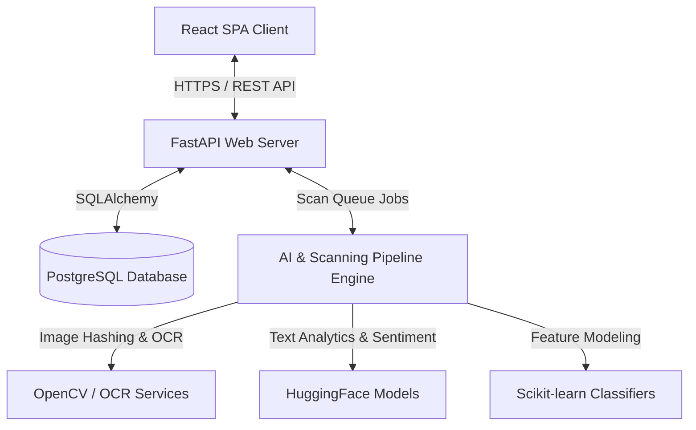

# Architecture Document

## System Architecture

## Component Design & Responsibilities

- **Frontend (React Client)**: Main entrypoint for analysts. Displays scan jobs, campaigns list, logo matching verification, and generates printable takedown evidence exports.
- **Backend Core**: Configures environments, db connection session makers, middleware (CORS, timing, logging), and exception handlers.
- **API Routers**: Versioned HTTP routes mapping entities to databases or queue handlers.
- **AI Processing Pipeline**: Specialized background threads or workers evaluating external web targets using specific algorithms.

## AI Inference Pipeline

The AI engine takes a target domain's visual screenshot and HTML content, running three concurrent evaluations:
1. **Visual Matcher (OpenCV)**: Evaluates image templates (e.g. logos, brand identity markers) against target images via Template Matching and perceptual hashing (pHash) to find exact or modified logo placements.
2. **Structural Matcher (Scikit-learn)**: Extracts layout structure representations from DOM trees (HTML tag frequencies, input position mappings, CSS styles) and flags high-similarity clones.
3. **Brand Extraction (HuggingFace)**: Uses lightweight text classification and Named Entity Recognition (NER) models to scan page text, header metadata, and copyright notices for brand name references.

## Coding Standards & Git Workflow

- **Python**: Enforce PEP 8. Use `black` for formatting and `flake8` / `mypy` for static analysis.
- **JavaScript/React**: Enforce clean functional components using React hooks. Use `eslint` rules.
- **Git workflow**:
  - Main branch (`main`) must compile and run at all times.
  - Work on feature branches (`feature/feature-name`) or bugfix branches (`bugfix/issue-name`).
  - Pull requests require a peer review and successful completion of backend pytest runs.
  - Frequent commits with descriptive messages.

## Folder Responsibilities & Module Ownership

- `backend/app/api/`: Routing endpoints.
- `backend/app/core/`: Security utils, configuration parser, application logger.
- `backend/app/models/`: Database models declaration.
- `backend/app/schemas/`: Pydantic validation schemas.
- `backend/app/services/`: Core logic (calculators, intelligence lookup).
- `backend/app/repositories/`: DB query abstractions.
- `backend/app/ai/`: Image processing, models loader, and NLP tasks.

## Security Checklist

- [ ] All API connections use HTTPS.
- [ ] Database credentials, API tokens, and secret keys are stored exclusively in `.env` and loaded via Pydantic Settings.
- [ ] CORS allowed origins are strictly configured (no wildcard allowed in production).
- [ ] SQL injections mitigated through parameterized SQLAlchemy queries.
- [ ] Scraper engines sanitize target inputs to prevent directory traversal and SSRF attacks.
