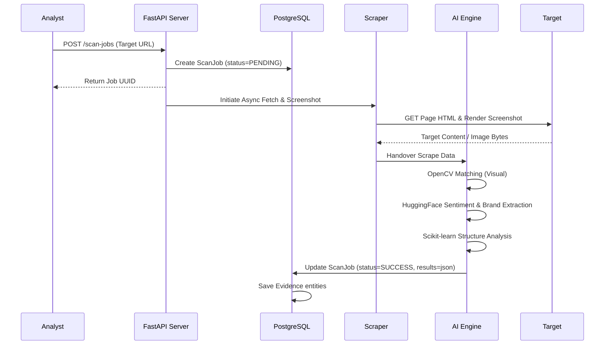

# Workflow Design

## Analyst Workflow

1. **Dashboard Entry**: The analyst lands on the ThreatLens dashboard, showing current alert statistics (high risk domains, pending scans, identified campaigns).
2. **Submit Scan URL**: The analyst enters a suspicious URL (e.g. `http://secure-login-bank-verify.com`) and clicks **Submit**.
3. **Queue Processing**: The UI polls the scan progress using the job UUID.
4. **Review Detection details**: Once the scan is complete, the analyst opens the result page showing visual comparison, NLP findings, matching scores, and screenshot preview.
5. **Campaign Linking**: The system suggests matching campaigns based on IP ranges, visual template similarities, or registrar credentials.
6. **Actioning/Reporting**: The analyst changes the status to `Confirmed Phishing` and exports the generated Takedown Report.

## Ingestion & Scanning Pipeline



## Detection & Risk Score Calculation

The risk engine computes the risk index based on static heuristic variables combined with machine learning outputs:

```text
Risk Score = (Age Heuristic * 0.15) + (SSL Heuristic * 0.15) + (Brand Keyword Match * 0.20) + (OpenCV Logo Match * 0.25) + (Structural Tag Similarity * 0.25)
```

- **Age Heuristic**: Newly registered domains (< 14 days old) add 15 points.
- **SSL Heuristic**: Self-signed or missing SSL certificates add 15 points.
- **Brand Keyword Match**: Presence of brand tokens in domain or path strings adds 20 points.
- **OpenCV Logo Match**: High-confidence templates found in screenshot analysis add up to 25 points.
- **Structural Tag Similarity**: High resemblance to official tag footprint layouts adds up to 25 points.

## Takedown Request Flow

Once verified, the platform allows analysts to generate a standard registrar abuse notification email:
- **Lookup Registrar**: Extract abuse email from WHOIS response.
- **Synthesize Draft**: Compile WHOIS data, visual evidence, DNS logs, and screenshot into an email template.
- **Send/Export**: Copy template or dispatch through SMTP configurations.
